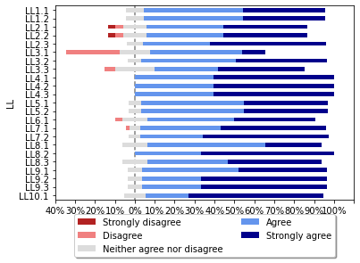
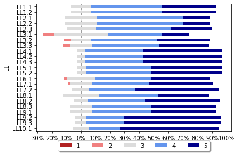

## Guidelines for the development of a critical software under emergency

During the COVID-19 pandemic, around the middle of March 2020, we have been developing a simplified mechanical lung  ventilator,  called  [MVM](http://mvm.care/)  (Mechanical  Ventilator  Milano),  to answer  the  high  request  of  ventilators  for  Acute  Respiratory Distress  Syndrome  (ARDS)  in  intensive  care  units.  The ventilator is now produced and certified for use in the EU, USA, and Canada. In this experience, which - software side - involved more  than  100  volunteer  researchers  towards  software certification at the extreme of their strength, we collected a set of lessons learned. 
From this experience, we have synthesised a set of guidelines that might help similar projects in the future.

In this page we collect all the material used in order to produce guiedlines for the development of a critical software under emergency:
- Lessons learned from the MVM project which have been proposed in our previous work: A. Bombarda et al., "Lessons Learned from the Development of a Mechanical Ventilator for COVID-19," 2021 IEEE 32nd International Symposium on Software Reliability Engineering (ISSRE), 2021, pp. 24-35, doi: [10.1109/ISSRE52982.2021.00016](https://ieeexplore.ieee.org/document/9700322)
- Validation of lessons learned executed in the context of two courses for the Italian engineering society. 
- Guidelines
- Validation of guidelines via questionnaires and interviews

### Lessons Learned

| Lessson learned | Description |
| --- | --- |
| LL.1.1 IEC 62304 and V-Model| The development process was strongly influenced by the IEC 62304 standard, so the V-model, although not mandated, is the “best fit” with regulatory requirements as it produces the necessary deliverables required when seeking regulatory approval. |
| LL.1.2 Use of agile practices| However, it was necessary to integrate the V-model with agile practices, to combine efficiency, quality, maintainability, and flexibility. |
| LL.2.1 Coordination effort| The project was successful but there was a quite huge overhead of coordination, with various calls every day from the morning till evening. The coordination of the team should not be underestimated. Open-source software development could be a good development experience from which projects of this nature can learn. |
| LL.2.2 Enlarging team| Adding people is not necessarily a good solution to improve the efficiency and effectiveness of a team.|
| LL.2.3 Commitment and participation| Having responsibility for each sub-activity and setting strict intermediate goals have favoured commitment and participation.|
| LL.3.1 Multiplicity of tools |The use of a great variety of tools (one tool for each particular purpose) even if not integrated and not specific for software project management, has provided indispensable support to the team.|
| LL.3.2 Templates and review process|Having a partner that provided the templates and a clear review process has helped to define which activities should be performed.|
|LL.3.3 Use of UML|Standard graphical notations like UML shown to improve communication and to be easily usable by non-software experts (very skilled in other fields, though).|
|LL.4.1 Written requirements|Not having written requirements since the beginning led to having various attempts to address the requirements in different software components. For this reason, precise system requirements are very important also in an emergency situation. Having developers referring to the same written documents without inconsistencies reduces the development time.|
|LL.4.2 Reverse engineering| For systems for which a prototype is present, especially if it is developed by domain experts, reverse engineering has shown to be a viable solution for discovering functionalities and configuration parameters to be included in system requirements.|
|LL.4.3 Need of a traceability system|A traceability system helps developers to trace all the requirements and their changes through all the development process.|
|LL.5.1 Upfront aspects balancing|As we can learn from software architecting, it is important to go towards “just-in-time architecture” and to find a balance between upfront aspects (what is planned before the start of development) and emerging aspects (what appears as decisions are taken in the course of the development, e.g. by fixing wrong assumptions or making decision deliberately postponed).|
|LL.5.2 Importance of the architecture|Software architecture is still important even during emergency development. In fact, we have experimented that without a well-defined architecture (as for the prototype), it was not clear how software components were supposed to synchronize and exchange information among them.|
|LL.6.1 Safety assurance effort|Isolating safety-critical features, by organizing the system in different components, has allowed us to focus the safety assurance effort on a limited portion of the system.|
|LL.7.1  Modularity and parallelization |Designing a product in a modular way has been a successful decision, since, in a distributed project (such as the one of the MVM) it has allowed different teams to work in parallel on different parts of the system.|
|LL.7.2 State machines for wide inter-pretability |We have found that using state machines, for the specification and the design, has contributed to favor the discussion on the adopted solutions even with people not used to software development since graphical representations are easily understandable.|
|LL.8.1 Mix of programming languages|Using several programming languages in a single project is usually discouraged [26]. However, in an emergency (such as during COVID-19) in which the products have to be delivered as soon as possible, we have experienced that having more languages allows the inclusion of more developers and speeds up the implementation process, with only a minimal effort in integration of the code.|
|LL.8.2 Coding standards and guidelines|Sharing the coding standards and guidelines (e.g., the importance of comments) with all the people involved in the implementation phase is of key importance, in particular with heterogeneous development groups, even during emergency development.|
|LL.8.3  Advantages of state machines in implementation|State machines added flexibility and maintainability since it was very simple to modify it and then regenerate code, which was directly integrated, through a wrapper, to the hand-written code.|
|LL.9.1 Testing not only safety-critical components|Defining in advance the safety classes of all the components in the developed system can significantly facilitate the testing activities. In fact, medical software safety standards do not mandate extensive unit testing for class A components. Thus, a good practice is to design the system in a modular way, isolating all the non-dangerous functions (i.e., in class A) that testers can limitedly check.|
|LL.9.2 Importance of testing|Besides what is required by the standards, testing activities are important when performed for safety-critical components. This is not an obvious aspect in heterogeneous aspects.|
|LL.9.3 Advantages of CI tools in community projects|As MVM has been a community project, where a lot of people have worked at the same time on the same system, CI tools have proved to be crucial for maintaining under control the modifications made by all the developers.|
|LL.10.1 Integration testing for SIMDs|It is challenging to develop and validate systems that integrate hardware, software, and mechanics by distributed teams. Often, real hardware is needed for testing the software that is affected or affecting a piece of hardware. Software-in-the-loop simulation requires a special setting with professional simulation tools and an accurate hardware model, which is not always available and reliable.|

### Validation of lessons learned

For each lesson learned we have asked: 
- Do you agree with the lesson learned?
  - Possible answers: Strongly Agree | Agree | Neither agree nor disagree (I don't mind these things) | Disagree | Strongly Disagree
- In your opinion, how important is the lesson learned?
  - Possible answers: 1 (very important) | 2 | 3 | 4 | 5 (not at all important)

The obtained results are summurized in the following graphs:

### Guidelines
| Guideline | Description | Rationale |
| --- | --- | --- |
| GL1 Plan-driven/predictive and agile integration| Integrate plan-driven/predictive processes with agile practices, to combine rigorousness with efficiency and flexibility. | The idea is to benefit from the good characteristics of predictive and agile processes.|
| GL2 Review process | --- |
| GL3 Documentation templates | --- |
| GL4 Competencies, resources and commitment initial estimation | --- |
| GL5 Definition of coordination team and the coordination plan | --- |
| GL6 Responsibilities assignment | --- |
| GL7 Flexible development teams |  |
| GL8 Inter-team coordination and communication| | 
| GL9 Intra-team coordination and communication| | 
|GL10 Define a traceability system|  |
|GL11 Use visual and graphical notations|  |
|GL12 Write precise requirements and reverse engineering|  |
|GL13 Define an architecture upfront|  |
|GL14 Limit the upfront architecture to stable decisions|  |
|GL15 Update the architecture|  |
|GL16 Exploit communities of practices|  |
|GL17 Isolate safety-critical parts|  |
|GL18 Use state machines in specifications|  |
|GL19 Use state machines for code generation|  |
|GL20|  |
|GL21|  |
|GL22|  |
|GL23|  |
|GL24|  |

<!--  Having trouble with Pages? Check out our [documentation](https://docs.github.com/categories/github-pages-basics/) or [contact support](https://support.github.com/contact) and we’ll help you sort it out. -->
